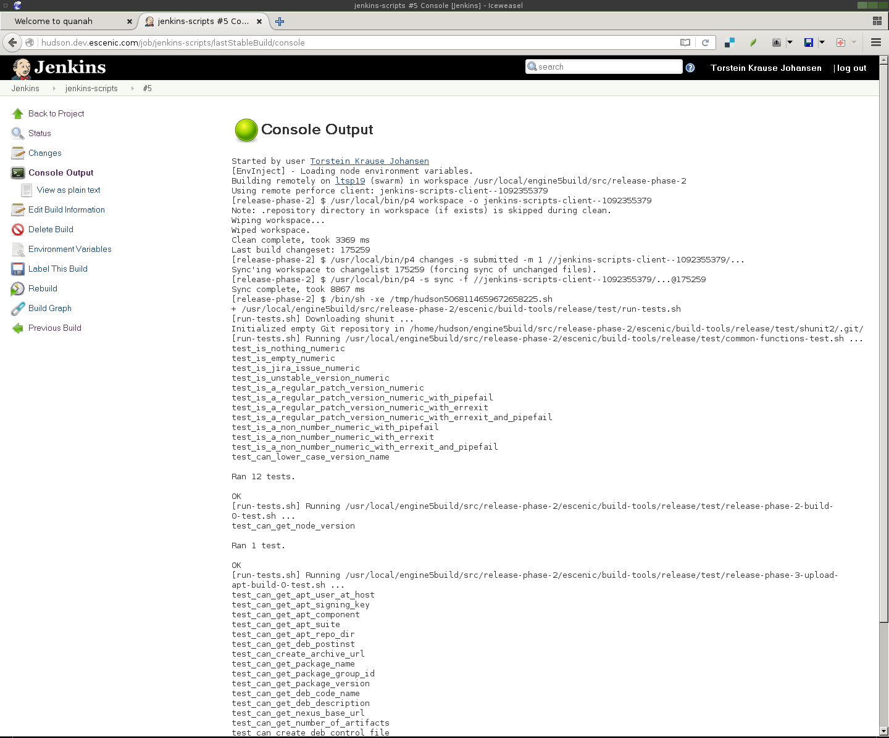

# Test Driven Development in BASH

> A talk by <a href="">torstein @ escenic</a>

---

# Why unit tests?

---

## confirm
that you've actually fixed the bug

---

## add
new features without breaking old

---

## re-factor
with confidence

---

## promotes
modular, de-coupled code

---

## TDD makes
you think about the user

---

## How a shell script starts

---

## just
a few lines

---

```sh
mkdir -p /var/lib/app/data
cd /var/lib/app/data
wget http://example.com/big-file.zip
```

---

## and add some
variables

---

```sh
url=http://example.com/big-file.zip
data_dir=/var/lib/app/data
mkdir -p ${data_dir}
cd ${data_dir}
wget ${url}
```

---

## hang on
perhaps it takes a parameter?

---

```sh
if [ $1 ]; then
   url=$1
else
  url=http://example.com/big-file.zip
fi

data_dir=/var/lib/app/data
mkdir -p ${data_dir}
cd ${data_dir}
wget ${url}
```

---

## wait a minute
could it make eggs too?

---

```sh
download_url() {
  data_dir=/var/lib/app/data
  mkdir -p ${data_dir}
  cd ${data_dir}
  wget ${url}
}

make_egg() {
  make "$1"
}

if [[ $1 == "http"* ]; then
  url=http://example.com/big-file.zip
  download_url
else
  make_egg "$1"
fi
```

---

## of course
I want logging

---

```sh
log_file=/var/log/$(basename $0).log

download_url() {
  data_dir=/var/lib/app/data
  mkdir -p ${data_dir}
  cd ${data_dir}
  wget ${url}
  echo "Downloaded $url to $data_dir ..." >> $log_file
}

make_egg() {
  echo "Making $1 ..." >> $log_file
  make "$1"
}

if [[ $1 == "http"* ]; then
  url=http://example.com/big-file.zip
  download_url
else
  make_egg "$1"
fi
```

---

## and make sure
it runs as the correct user

---

```sh
log_file=/var/log/$(basename $0).log

download_url() {
  data_dir=/var/lib/app/data
  mkdir -p ${data_dir}
  cd ${data_dir}
  wget ${url}
  echo "Downloaded $url to $data_dir ..." >> $log_file
}

make_egg() {
  echo "Making $1 ..." >> $log_file
  make "$1"
}

if [[ $(whoami) == root ]]; then
  echo "$(basename $0) cannot run as root"
  exit 1
fi

if [[ $1 == "http"* ]; then
  url=http://example.com/big-file.zip
  download_url
else
  make_egg "$1"
fi
```

---

## Proposed code structure

Break your code up into these folders:

```
.
├── bin
├── lib
└── test
```

---

## example
The super-extremely-useful `add-two` command:

```
.
├── bin
│   └── add-two
├── lib
│   └── add-two-lib.sh
└── test
    ├── add-two-test.sh
    └── run-tests.sh
```

---

## xunit

Enter unit testing: [xunit](https://en.wikipedia.org/wiki/XUnit)

---

### write your own

First, I implemented my own unit testing library...

---

### ... and then
I discovered what's out there 😊

---

### shunit2

[shunit2](https://github.com/zandev/shunit2) provides all the methods
you know from JUnit:

```sh
assertEquals
assertFalse
assertNotEquals
assertNotNull
assertNotSame
assertNull
assertSame
assertTrue
fail
failNotEquals
failNotSame
failSame
```

---

```sh
## @override shunit2
setUp() {
  source "$(dirname "$0")/../lib/$(basename "$0" -test.sh)-lib.sh"
}

## @override shunit2
tearDown() {
  :
}

test_add_2_to_3_yields_5() {
  local expected=5
  local actual=
  actual=$(add_two 3)
  assertEquals "${expected}" "${actual}"
}
```

---

## Seeing is believing

Check out this example project: <a
href="https://gitlab.com/skybert/gone">https://gitlab.com/skybert/gone</a>


---

## Continuous integration

When someone checks in code, run all tests to make sure he/she hasn't
broken anything.

---

## Why shouldn't we do this for BASH scripts too?

---

### CI on Jenkis



---

## That's it, now get coding! 😊

— [\@torsteinkrause](http://twitter.com/torsteinkrause)

---
