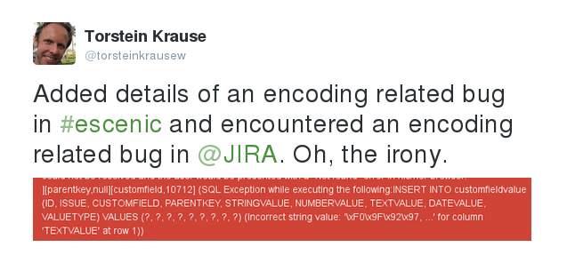
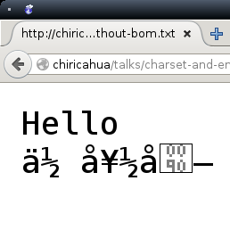
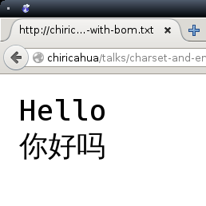
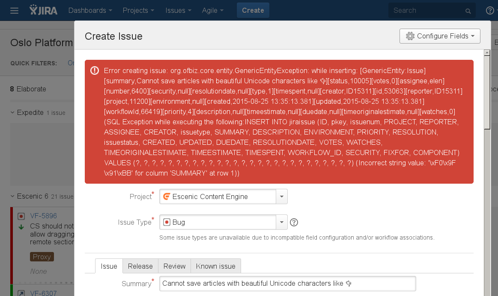
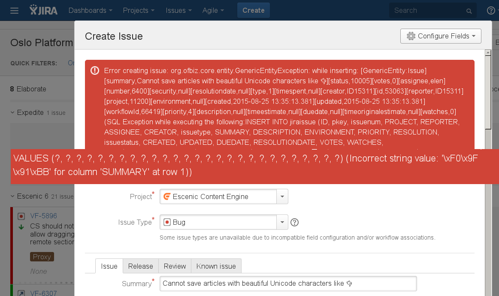

# Squares & � marks

> An adventure into the world of character sets and encodings

by
<a href="torstein.k.johansen AT gmail DOT com">
  Torstein Krause Johansen
</a>

---

##  👻

I've been a programmer for 16 years and there are two problems that
always haunt me.

---

## 👻

<span class="fragment">Date conversion</span>

<span class="fragment">Character encoding</span>

---

## Even Jira



---

## whois

### ⛹

Keyboard maniac at [Escenic](http://escenic.com) making a GREAT
Content Management System for the media industry

<div style="padding: 1em;">

</div>

Customers all over the world: From the
[Daily Mirror](http://dailymirror.co.uk) in the UK,
[Thai PBS ](http://welt.de) in ประเทศไทย to
[Dinamani](http://dinamani.com) in இந்தியா

---

## Let's talk about

> Best regards

> Viele Grüße

> Beste ønsker

---

Or just

---

# ���

---

## Goals for this talk

> Know

<ul>
  <li class="fragment">
    What a *character set* is and what a *character encoding* is
  </li>
  <li class="fragment">
    Differentiate encoding problems from display problems
  </li>
  <li class="fragment">
    How to use UTF-8 everywhere
  </li>
</ul>

---

But first, a wee <h1>Quiz</h1> to get your brain cells going

---

## Unicode is ....

1. An encoding
2. A character set

---

## UTF-8 is ....

1. An encoding
2. A character set

---

## Can you store

>  "Alpha and Ω" in a database with ISO 8859-1?

1. Yes
2. No

---

## If you see big squares

> instead of letters, it's because ...

1. Encoding problem
2. Missing font
2. Decoding problem

---

## My.java has Windows 1252 encoding

> will æ, ø and å be written correctly?

1. It depends
2. Yes
3. No

---

## What has happened?

> Kjører

1. Wrong font
2. Encoding/decoding mismatch

---

# Part I

Crash course in

### Character sets & encodings

---

## ASCII

>  American Standard Code for Information Interchange


---

## ASCII

<ul>
  <li>An absolute genius of a standard</li>
  <li class="fragment">...as long as you speak English</li>
</ul>

---

## ASCII

<table>
  <tr>
    <th>Character</th>
    <th>Decimal</th>
    <th>Binary</th>
  </tr>
  <tr>
    <td>A</td><td>65</td><td>1 0 0 0 0 0 1</td>
  </tr>
  <tr>
    <td>B</td><td>66</td><td>1 0 0 0 0 1 0</td>
  </tr>
</table>

- One character corresponds to one numeric value
- 7 bit

---

## ASCII

<table>
  <tr>
    <th>Character</th><th>Decimal</th><th>Binary</th>
  </tr>
  <tr>
    <td>a</td><td>97</td><td>1 1 0 0 0 0 1</td>
  </tr>
  <tr>
    <td>b</td><td>98</td><td>1 1 0 0 0 1 0</td>
  </tr>
</table>

> Value for upper case letter + 32 = value for the lower case letter.
> Brilliant!

---

## Then came the Europeans


---

Need for new characters that didn't exist

---

## No room in the inn

- All the 127 rooms were taken
- ...so they added another zero

> → **0** 1 0 0 0 0 0 1

---

## 256 characters, hurrah!

---

## Europeans could now enter the computer age

---

Endless <h2>possibilities</h2> with 8 bits:

- Code pages
- ISO-8859-*

---

## Then came the Asians


> 你好嗎？

---

## A whole lot of nonsense ☠

- Many made their own character sets
- Incompatibility all around

---

## Finally peace
## ☮

---

## Unicode

---

## Unicode

- Caters for all characters and letters in all dead and spoken languages
- Has today more than 110 000 characters
- And plenty of room to spare

---

Unicode is a

## Character set

---

## Character set

> A defined list of characters recognized by the computer hardware and
> software. Each character is represented by a number.

[webopedia.com](http://www.webopedia.com/TERM/C/character_set.html)

---

## Each entry has
<ul>
<li class="fragment">A numeric value (code point)</li>
<li class="fragment">A name</li>
</ul>

---

## Unicode examples

<table>
  <tr>
    <th>Character</th>
    <th>Code point</th>
    <th>Name</th>
  </tr>
  <tr>
    <td>Ω</td>
    <td>937</td>
    <td>GREEK CAPITAL LETTER OMEGA</td>
  </tr>
  <tr class="fragment">
    <td>Å</td>
    <td>197</td>
    <td>LATIN CAPITAL LETTER A WITH RING ABOVE</td>
  </tr>
</table>

---

## How to find the Unicode value

Also known as the **code point** of a character.

For instance "~" (tilde)?

---

## Java

    String c = "~";
    int unicodeCodepoint = (int) c.charAt(0);

---

## Java 🐘

    String s = "🐘";
    int unicodeCodepoint =  Character.codePointAt(s, 0);

---


## JavaScript

    var c = "~";
    var unicodeCodepoint = c.codePointAt(0);

----

## Wikipedia

http://en.wikipedia.org/wiki/~

---

## Emacs

    M-x describe-char

---

## Emacs

```
             position: 25 of 26 (92%), column: 24
            character: ~ (displayed as ~) (codepoint 126, #o176, #x7e)
    preferred charset: ascii (ASCII (ISO646 IRV))
code point in charset: 0x7E
               script: latin
               syntax: _    which means: symbol
             category: .:Base, a:ASCII, l:Latin
             to input: type "C-x 8 RET 7e" or "C-x 8 RET TILDE"
          buffer code: #x7E
            file code: #x7E (encoded by coding system utf-8-unix)
              display: by this font (glyph code)
    xft:-unknown-DejaVu Sans Mono-normal-normal-normal-*-22-*-*-*-m-0-iso10646-1 (#x61)

Character code properties: customize what to show
  name: TILDE
```

---

## RTFM

Only a few key presses away on any Unix:

```
$ man ascii
$ man charset
$ man unicode
$ man utf-8
$ man iconv
```

---

### So what's UTF-8 then?

---

UTF-8 is a character <h2>encoding</h2>

---

## Character encoding

> ... a character encoding is used to represent a repertoire of
> characters by some kind of an encoding system

[wikipedia.org](https://en.wikipedia.org/wiki/Character_encoding)

---

## UTF-8

<ul>
  <li class="fragment">ASCII compatible</li>
  <li class="fragment">
    A standard so simple you can explain it on a napkin
  </li>
</ul>

---

## Who is this?


[linuxbeard.com](http://linuxbeard.com/post/6855753580/ken-thompson-and-dennis-ritchie-were-researchers)

---

## Created over a meal

- Ken Thompson & Rob Pike went for dinner, September 1992.
- UTF-8 was invented by Ken Thompson
- Wrote it down on a placemat

---

## Killer features

1. All ASCII strings are valid UTF-8
2. An ASCII string encoded in UTF-8 has **0** as the first bit.
3. Easy to navigate and find current, previous and next character.
4. Never eight 0s in a row

---

## UTF-8 - 1 byte

```
                                   0xxxxxxx
```

---

## UTF-8 - 2 bytes

```
                          110xxxxx 10xxxxxx
                                   0xxxxxxx
```
---

## UTF-8 - 3 bytes

```
                 1110xxxx 10xxxxxx 10xxxxxx
                          110xxxxx 10xxxxxx
                                   0xxxxxxx
```

---

## UTF-8 - 4 bytes

```
       11110xxx 10xxxxxx 10xxxxxx 10xxxxxx
                1110xxxx 10xxxxxx 10xxxxxx
                         110xxxxx 10xxxxxx
                                  0xxxxxxx
```

---

## The difference between Unicode and UTF-8

- Unicode is a table with numeric values and names for all characters
in the whole wide world.

- UTF-8 is one of several ways to encode a Unicode numeric value to
  bytes.

---

## Why is this important?

- UTF-8 : ASCII compatible
- UTF-16 : **not** ASCII compatible (Windows & Java)
- UTF-32 : **not** ASCII compatible

---

# Part II
### Character encoding in Java
HTML, HTTP & friends

---

## Java

Java's
[internal representation of strings ](https://docs.oracle.com/javase/7/docs/technotes/guides/intl/overview.html)
is UTF-16.

    final String name = getNameFromFacebook(id);

---

## Specify the encoding whenever you can

---

## Resource bundles

- Java resource bundles
  [must be encoded in ISO-8859-1](http://docs.oracle.com/javase/7/docs/api/java/util/PropertyResourceBundle.html).

- Characters that don't fit into ISO-8859-1 must therefore be
  represented using Unicode escape notation:

```
$ native2ascii -encoding utf8 ghost-text-utf8 ghost-text.properties
```

---

## A ghostly example 👻

```
$ cat ghost-text-utf8
ghost_title=This is a 👻

$ native2ascii -encoding utf8 ghost-text-utf8
ghost_title=This is a \ud83d\udc7b
```

---

Before you <h2>fall in love💘</h2>
with the Unicode escapes

---

## cons

- The escapes are translated before the code is compiled
- Harmless comments become hidden backdoors
- Or just break the build 💣


---

## Resource bundles

- Possible to use UTF-8 in your `.properties` files if you do:

```
public String getPropertyFromUTF8File(final String pKey)
  throws IOException {

  ResourceBundle bundle = ResourceBundle.getBundle(
    "ghost-text-utf8", Locale.ENGLISH);
  String value = bundle.getString(pKey);
  return new String(value.getBytes("ISO-8859-1"), "UTF-8");
}
```

---

## Can you trust String#length()?

```
@Test
public void ghostIsOneCodeUnit() {
  final String ghost = "👻";
  assertEquals("ghost is just one character", 1, ghost.length());
}
```

---

## Can you trust String#length()?

```
@Test
public void ghostIsOneCodeUnit() {
  final String ghost = "👻";
  assertEquals("ghost is just one character", 1, ghost.length());
}
```

```
Failed tests: ghostIsOneCodeUnit(GhostLengthFailingTest):
  ghost is just one character expected:<1> but was:<4>
```
---

## A safer bet

Use
[String#codePointCount(from, to)](http://docs.oracle.com/javase/7/docs/api/java/lang/String.html#codePointCount(int,%20int)):

```
@Test
public void ghostIsOneCodePoint() {
  final String ghost = "👻";
  assertEquals(
    "ghost is just one character",
    1,
    ghost.codePointCount(0, ghost.length())
  );
}
```

---

## Text rendering control

Number of visible glyphs on the screen:

```
BreakIterator.getCharacterInstance();
```


---

## Maven

> Ever seen this one?

```
[WARNING] File encoding has not been set, using platform encoding
          UTF-8, i.e. build is platform dependent!

```

----

## Make your builds safe

```
<properties>
  <project.build.sourceEncoding>UTF-8</project.build.sourceEncoding>
</properties>
```

---

## You can now use UTF-8 in your source files

A ♥ looks so much better than `\u2665`

---

## XML & JSON

    <?xml version="1.0" encoding="utf-8"?>

- The [XML specification](http://www.w3.org/TR/xml/#charencoding)
dictates that the standard encoding to be
[UTF-8](http://en.wikipedia.org/wiki/UTF-8)
- All XML parsers must as a minimum support UTF-8
- JSON [must be encoded](https://www.ietf.org/rfc/rfc4627.txt) in a
  Unicode encoding, UTF-8 is default

---

## Encoding in ANY file?

Your editor can specify the encoding when it writes the file to disk,
burning a mark in it using a so called BOM.

---

## Did you say BOM?

---

## BOM

- Is something that we can use if cannot write the encoding into
the file's contents.
- For instance when we when write a plain text file.

---

## BOM

An example of a
[UTF-8 encoded file without BOM](hello-without-bom.txt)




---

## BOM

An example of a [UTF-8 encoded file with BOM](hello-with-bom.txt)



---

## BOM - beware

> if you're counting bytes

- Some encodings automatically add a BOM
- UTF-16 adds a two byte BOM

---

## HTTP

When we surf on [facebook.com](http://facebook.com) or write Java code
that consume REST, RPC over HTTP and SOAP services, the server says
which encoding the contents are serialised with:

    $ GET http://vg.no
    ..
    Content-Type: text/html; charset=iso-8859-1

---

# Wait!

> Why does it say charset?

---

## MIME is to blame

---

## MIME is to blame

- MIME, [RFC 2045, May 1996](https://tools.ietf.org/html/rfc2045),
  used the term "charset"
- HTTP 1.0, [RFC 1945, May 1996](http://tools.ietf.org/html/rfc1945),
  included MIME.

---

## HTTP

- HTTP wanted to keep the terminology consistent, but acknowledges:

> Note: This use of the term "character set" is more commonly referred
> to as a "character encoding." However, since HTTP and MIME share the
> same registry, it is important that the terminology also be shared.

---

## HTML

Inside the HTML file itself, it's also important that the encoding
is correct so that the contents is _displayed_ properly in the web
browser:

    <meta http-equiv="Content-Type" content="text/html; charset=utf-8"/>

---

## Runtime environment

In addition to how the data are stored and serialised it's also
important that we take care of things on our side:

> → Fonts

---

### JVM parameters

```
-Dsun.jnu.encoding=utf-8
-Dfile.encoding=utf-8
```

---

### JDBC connection string

    jdbc:jtds:sybase://db01:4100/mydb?characterEncoding=utf8
    jdbc:mysql://db01:3306/mydb?autoReconnect=true&amp;\
                                useUnicode=true&amp;\
                                characterEncoding=UTF-8&amp;\
                                characterSetResults=UTF-8

---

### UNIX locale

```
$ locale -a | grep en_GB.utf8
$ export LC_ALL=en_GB.utf8
$ export LANG=en_GB.utf8
```

---

## Myth #1

> The encoding of the Java file decides how the data that are written
> by this Java component are written to the database.

---

## Myth #1 busted

The file encoding only decides how the characters in the Java file
itself are stored and displayed:
```
/**
 * @author Søren Westergård
 */
 final static String PRODUKT = "UFØ";
```

----

## Myth #1 busted

Data encoding, on the other hand, decides how the _data_ (which the
Java program writes or reads) are read and written:

```
new OutputStreamWriter(out, "UTF-8");
```

---

## Myth #2

> The encoding inside system X affects the data it sends out and how
> our system saves these data in our system.

---

## Myth #2 busted

It's irrelevant that system X stores its data internally as
[Windows 1252](http://en.wikipedia.org/wiki/Windows-1252) as long as
the web services through which it exposes these data returns XML
encoded as [UTF-8](http://no.wikipedia.org/wiki/UTF-8).

---

# Part III

<h3> The database</h3>

---

## The database

<ul>
  <li>
    Many databases in Europe used (and several still use!)
    [ISO-8859-1](http://no.wikipedia.org/wiki/ISO_8859-1) encoding.
  </li>
  <li class="fragment">
    If someone attempts to write a character into these databases that's
    not covered by
    [ISO-8859-1](http://no.wikipedia.org/wiki/ISO_8859-1), for instance "*–*"
    [Unicode EN DASH](http://no.wikipedia.org/wiki/Unicode)
  (hyphen)...
  </li>
  <li class="fragment">
    the database will throw an <span class="fragment highlight-red">error</span> up to the
    web application.
  </li>
</ul>

---

## User → .. → DB 💣

<a href="different-encodings.svg">
  
</a>


```
User (ok!) → Flex (ok!) → BlazeDS (ok!) → Java (ok!) → Database (BANG!)
```

---

## MySQL users beware

What's wrong with this statement?

```
mysql> create database mydb
       character set utf8
       collate utf8_general_ci;
```

---

## MySQL utf8

The MySQL `utf8` table & column encoding is not real UTF-8

---

## MySQL utf8

Only 1-3 byte characters supported.

---

## MySQL utf8mb4

For full UTF-8 support, use the `utf8mb4` type instead.

---

## MySQL utf8mb4

This will fix obscure errors like:



---

## MySQL utf8mb4

This will fix obscure errors like:



---

## When you thought you were done

---

## Once your full stack is Unicode friendly

---

## Collation may still haunt you 👻

---

## Hæ?

<!--
(Norwegian for [WAT?](https://www.destroyallsoftware.com/talks/wat))
-->

---

## Collation

- How the database handles strings
- Sorting
- Comparing

---

## Fun fact

Default collation in MySQL is "Swedish Latin 1".

---

So to sum ut, let's take that <h1>Quiz</h1> again

---

## Unicode is ....

1. An encoding
2. A character set <span class="fragment">✓</span>

---

## UTF-8 is ....

1. An encoding <span class="fragment">✓</span>
2. A character set

---

## Can you store

>  "Alpha and Ω" in a database with ISO 8859-1?

1. Yes
2. No <span class="fragment">✓</span>

---

## If you see big squares

> instead of letters, it's because ...

1. Encoding problem
2. Missing font <span class="fragment">✓</span>
2. Decoding problem

---

## My.java has Windows 1252 encoding

> will æ, ø and å be written correctly?

1. It depends <span class="fragment">✓</span>
2. Yes
3. No

---

## What has happened?

> Kjører

1. Wrong font
2. Encoding/decoding mismatch <span class="fragment">✓</span>

---

## Summary

> for the impatient

- Use UTF-8 everywhere <span class="fragment">✓</span>

---

## Further exploration into the world of Unicode

- [UTF-8 and Unicode FAQ for Unix/Linux](http://www.cl.cam.ac.uk/~mgk25/unicode.html):
- Explore Unicode visually using
[Unicode Character Table](http://unicode-table.com/en/)
- Full
  [source code for my code examples](https://github.com/skybert/skybert-net/blob/master/src/talks/charset-and-encoding/charset-talk-code)
  can be found on Github
- [Java Rough Guide To Character Encoding](http://illegalargumentexception.blogspot.no/2009/05/java-rough-guide-to-character-encoding.html)
- [Unicode in Windows' CLI](http://illegalargumentexception.blogspot.no/2009/04/i18n-unicode-at-windows-command-prompt.html#charsets_javaconsole)
- [UTF-8](http://en.wikipedia.org/wiki/UTF-8) on Wikipeidia


---

## Q?

---

# U+0004

> END OF TRANSMISSION

🐦 [\@torsteinkrausew](https://twitter.com/torsteinkrausew)

🌐 [http://skybert.net/talks](http://skybert.net/talks)

✏ <a>torstein@escenic.com</a>


<!--

start with diner story?

def:
glyph
font
character set
character enoding
code point
code unit

goals:
char set & encoding are different
diff between rendering and encoding errors
use utf-8 everywhere

resource bundles
really latin1?

bom
with and without, picture instead of .txt files?

mime/http/html charset
no wonder people are confused

quiz?
have it in?
ask it up front?

example of locale setting

jira encoding bug
second slide with zoomed overlay

wat phonetic

AIDA
Attention Interest Desire Action

summary
too much text
drawings? pictures?

tydelig bolker
gir pusterom, nå er vi ferdige med ...

1. history
2. java & friends
3. database
4. what to do when you get back to your computer

resource bundles
escapes, before compiler

-->
