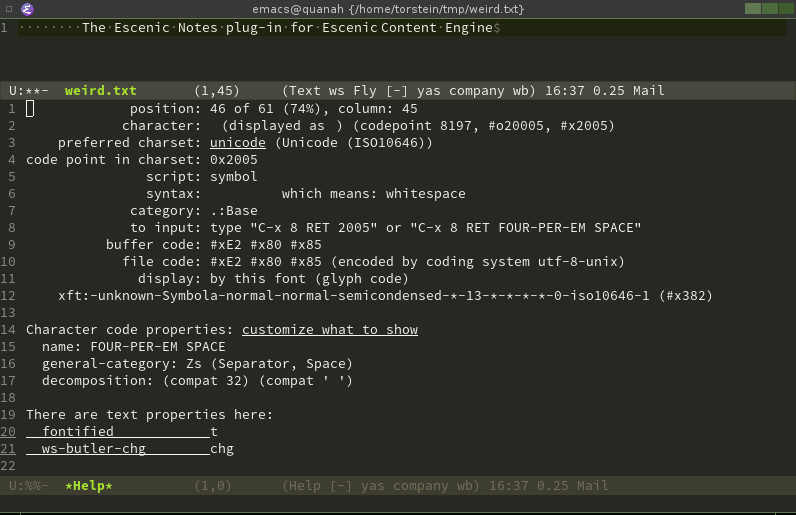
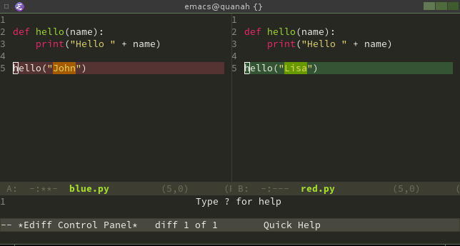

# Every Day Emacs

> How Emacs can make every man's every day better 😃

---

## Whitespace

> No better editor tool to debug white space issues IMHO

---

## What's the strange character between 'Escenic' and 'Content'?

> Escenic Content Engine

---

## Show `whitespace-mode`

---

## Figure out the character under the cursor

<kbd>Alt</kbd> + <kbd>x</kbd> `describe-char`

<a href="describe-char.png">
  
</a>

---

## Tidy up the current file
- `delete-trailing-whitespace`
- `untabify`

---

## Change encoding of the current file
- line endings
- content encoding
- change encoding: `set-buffer-file-coding-system`

---

## Auto completion :: word

<kbd>Alt</kbd> + <kbd>/</kbd> ➡ `dabbrev-expand`

---

## Auto completion :: sentence

<kbd>Alt</kbd> + <kbd>SPACE</kbd> ➡ `hippie-expand`

---

## Auto completion :: emojis 😉

<kbd>Ctrl</kbd> + <kbd>RET</kbd> ➡ `company-complete`


---

## Eye candy

---

### Line numbers
`global-linum-mode`

---

### Miniature map of the file (like Sublime)
```
(require 'nurumacs)
(setq nurumacs-map t)
```

<kbd>Alt</kbd> + <kbd>x</kbd> `nurumacs-map-toggle`

---

## Themes

<kbd>Alt</kbd> + <kbd>x</kbd> `load-theme`

<kbd>Alt</kbd> + <kbd>x</kbd> `disable-theme`

---

## Searching

---

## Regular search in current file
- <kbd>Ctrl</kbd> + <kbd>s</kbd> ➡ `isearch-forward`
- <kbd>Ctrl</kbd> + <kbd>r</kbd> ➡ `isearch-backward`

---

## Awesome search in current file
`helm-swoop`

---

## Search in all files in project
<kbd>Alt</kbd> + <kbd>x</kbd> `projectile-grep`

---

## Super fast search in directories
<kbd>Alt</kbd> + <kbd>x</kbd> `ag`

---

## Find method in file

<kbd>Ctrl</kbd> + <kbd>,</kbd> ➡ `imenu`

---

## Spell checking

- <kbd>Alt</kbd> + <kbd>$</kbd> ➡ `ispell-word`
- <kbd>Alt</kbd> + <kbd>x</kbd> `ispell-buffer`

---

## Source code control

---

## View change log for file

<kbd>Ctrl</kbd> + <kbd>x</kbd> <kbd>v</kbd> <kbd>l</kbd> `vc-print-log`

---

## View changes to current file (or directory)

<kbd>Ctrl</kbd> + <kbd>x</kbd> <kbd>v</kbd> <kbd>=</kbd> `vc-diff`

---

## Git status

<kbd>Alt</kbd> + <kbd>x</kbd> `magit-status`

---

## Diff two files

<kbd>Alt</kbd> + <kbd>x</kbd> `ediff-files`

<a href="ediff-files.png">
  
</a>

---

## Edit text

---

## Edit text in many places

<kbd>Ctrl</kbd> + <kbd>></kbd> ➡ `mc/mark-next-like-this`

---
