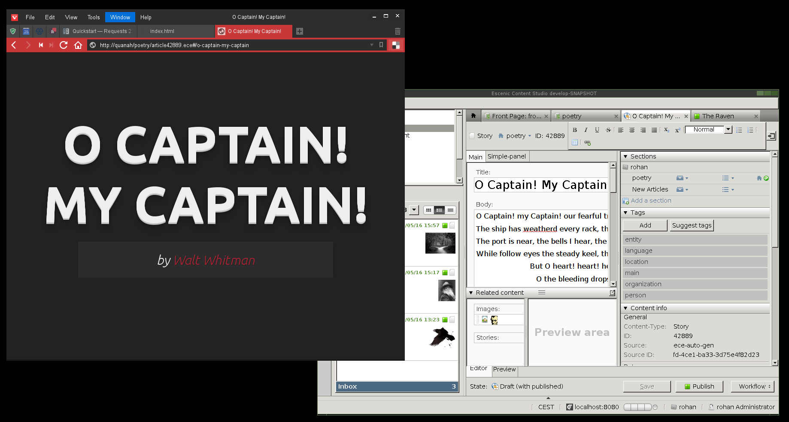

## Escenic template development in Python & Jinja2

> by <a href="">torstein @ escenic</a>

---

## Python 🐍

The [best scripting language](http://python.org) in the world IMHO 😊

---

## Jinja2

[Hugely popular template language](http://jinja.pocoo.org/) in the Python world.

---

## Jinja2

Ported to many other platforms, including JavaScript

---

## Python harness

```

app = Flask(__name__)
cook_url = "http://localhost:8000/rohan"

@app.route("/<section>/<article>.ece")
def get_article(section, article):
    r = requests.get(cook_url + "/" + section + "/" + article + ".ece")
    return render_template("article.html", data=r.json())

if __name__ == '__main__':
    app.run(debug=True)

```

---

## Writing Escenic templates in Jinja2

```
<h1>{{ data.title }}</h1>
<div id="body">
  
    <p>{{ line[1] }}</p>
  
</div>
```

---

## Extensions can be written in Python!

- no need for Java, Struts & JSP

---

## Extensions in Python example

Goal: Want to create an HTML element ID based on the content item
title. If the title is:

> Rocking All over the World

I want:

```
<section id="rocking-all-over-the-world">
```

---

## Extensions in Python example

```
def filter_create_xml_id(value):
    if value is None:
        return ""
    return value.replace(" ", "-").lower()

if __name__ == '__main__':
    app.jinja_env.filters["xmlid"] = filter_create_xml_id
```

---

## Extensions in Python example

The Jinja2 template can now use the extension like this:

```
<section id="{{ data.title | xmlid }}">
```

---

## Website implemented in Python & Jinja2

- Poetry site
- Each poem is presented as an HTML5 slide show using
  [reaveal.js](https://github.com/hakimel/reveal.js/)
- Each line of a poem is a new slide

---

## www.poetry.com


---

## www.poetry.com



---

## www.poetry.com


---

## Talk is cheap, show me the code

Check out the source from:

[stash/tkj/python-rendering-engine](https://cci-jira.ccieurope.com/stash/users/tkj/repos/python-rendering-engine/)

---

## That's it
✏ torstein @ escenic dot com

---

