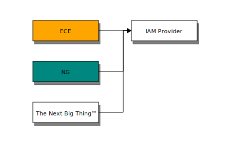
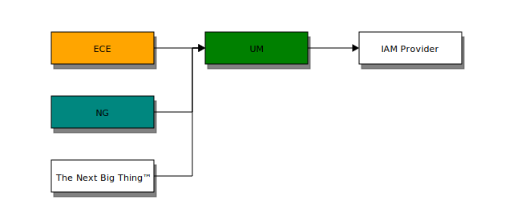

# CUE User Manager 🔒, 🔏 & 👨👩‍💼

— A sneak peek

> by <a href="">#squad-user-management</a>

---

# Why?

---

## Consolidation

- Authentication 🔒
- Authorization 🔏
- Identity management  👨👩‍💼

---

# What?!!

---

## Authentication 🔒

- user login

---

## Authentication 🔒

→ [OpenID Connect](http://openid.net/specs/openid-connect-core-1_0.html) (not the same as OpenID 1.0 & 2.0)

---

## Authorization 🔏

What are you allowed to do with what?

- Groups 👪
- Roles ‍🎨, 🚀, 🍳, ‍⚖
- Sections 📂

---

## Authorization 🔏

→ [UMA
  2](https://docs.kantarainitiative.org/uma/ed/oauth-uma-grant-2.0-06.html),
  User-Managed Access

---

## Identity management 👨👩‍💼

Create, update, delete and read user information.  

---

## Identity management 👨👩‍💼

→ [SCIM](http://www.simplecloud.info/), System for Cross-domain Identity Management.

- RFC 7642
- RFC 7643
- RFC 7644

---

## Loosely coupled - today



---

### Loosely coupled - with UM



---

## Design goals 🚀

- ECE, NG & Co doesn't know about which IAM provider(s) are used, they
  just use UM
- Future proof (OIDC is 🔥 today, might not be in 5 years)
- No migration (aka silent migration)

---

## Future proof

- 2010-02 OpenID support in ECE. Google,
  Yahoo, Facebook.
- 2010-10 Facebook completely changes its OpenID API
- 2012-10 Facebook changes its OpenID API again
- 2014-03 OpenID Connect support in ECE

---

## Design goals 🚀

- No future changes needed in ECE, NG & Co (auth, authz, identity)
- They just need to support UM

---

## Design goals in UM backend 🚀

- Use open standards for everything (auth, authz, identity)
- No vendor lock-in

---

## Design goals 🚀

- CUE, ECE & NG are the obvious clients
- But there may be many more that we haven't thought of
- UM make no assumptions about ECE, NG or CUE.
- A client could just be `curl` 

---

## Milestone I

- Authentication 🔒
- Silent migration 😯

---

## Milestone II

- Authorization 🔏
- Identity management  👨👩‍💼

(Still requires users to exist in ECE (silently migrated)).

---

## Milestone III

- Delegate all calls to UM
- Users no longer _need_ to exsist in ECE
- Delegate all user related calls

```
class ArticleImpl {
  List<Person> getAuthors() {
    return toPersons(mUserManager.getAuthors());
  }
}
```

---

## Milestone IV ?

- Remove lots of code!
- Users, groups, roles, protection domains++ 

---

## Gluu - features

- ✔ OIDC (authentication) 🔒
- ✔ UMA  (authorisation) 🔏
- ✔ SCIM (identity management) 👨‍👩💼
- Plus much more 🏈🚴🌯🐛👽

---

## Gluu - maturity

- ✔ 3.5 years old
- ✔ Open source, MIT licensed
- ✔ [Commercial support](https://www.gluu.org/gluu-server/pricing/)
  available from Gluu Inc 💰

---

## Gluu - health

- ✔ Actively developed
- ✔ Immediate response on PRs
- ✔ Java, easy to read and build

---

## Where is UM today?

---

## Authentication 🔒

```
$ GET http://um/auth
```

---

## Authentication 🔒

- ✔ Works with Gluu 
- ✔ Works with KeyCloak
- ✔ And probably (all) other OIDC providers too

---

## Identity management - getting current user 👨👩‍💼

```
$ GET http://um/user/me
```

---

## Identity management - user CRUD 👨👩‍💼

```
C $ POST   http://um/user
R $ GET    http://um/user/id/<id>
U $ PUT    http://um/user/id/<id>
D $ DELETE http://um/user/id/<id>
```

`<id>` can be e.g. `cn=lisa.doe,ou=Politics,dc=newspaper,dc=com` (user
id in Active Directory) or the ECE profile URL
`http://ece6/webservice/person/123`.


---

## Identity management - search for users by email 👨👩‍💼

```
$ GET http://um/user/by/email/indy@skybert.net
$ GET http://um/user/by/email/@skybert.net
```

---

## CUE - login through UM


---

## CUE - login through UM & AD


---

## User sync - ECE → UM → IAM


ECE pushes, uses UM REST endpoint. Doesn't know which IAM is used.

---

## User sync - AD → IAM 


IAM pulls, AD is oblivious.

---


## That's it

✏ torstein @ escenic dot com

---

